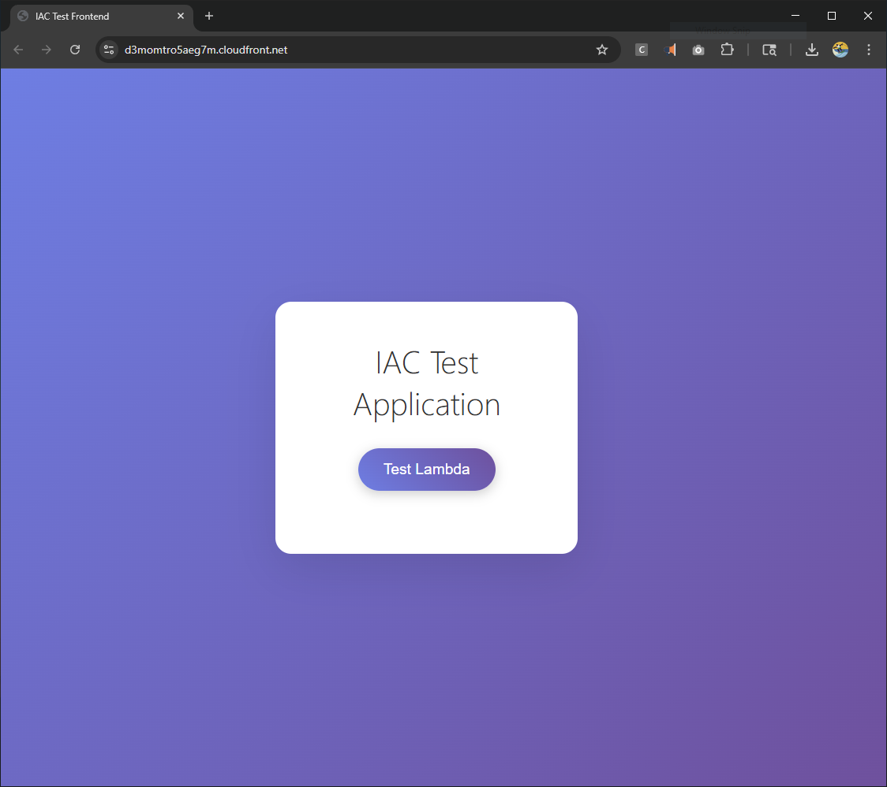
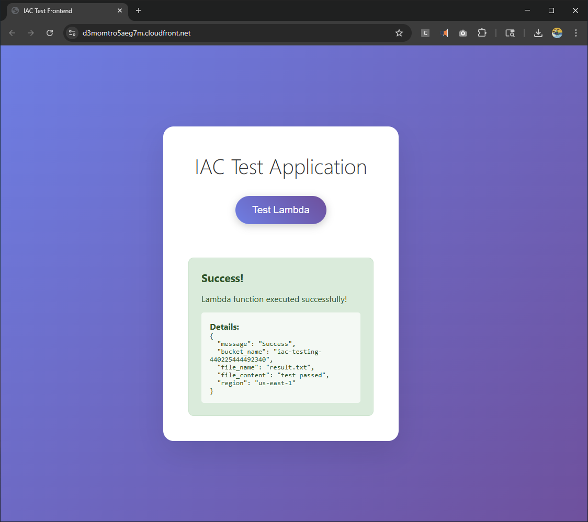

# Infrastructure as Code

A serverless application for AWS infrastructure automation with Terraform.

## Architecture

```
┌─────────────────┐      ┌─────────────────┐      ┌─────────────────┐      ┌─────────────────┐
│                 │      │                 │      │                 │      │                 │
│  Angular SPA    │─────▶│  Spring Boot    │─────▶│     Lambda      │─────▶│   S3 Bucket     │
│  (CloudFront)   │      │  (ECS Fargate)  │      │    (Python)     │      │   (Storage)     │
│                 │      │                 │      │                 │      │                 │
└─────────────────┘      └─────────────────┘      └─────────────────┘      └─────────────────┘
        │                         │                         │
        │                         │                         │
        ▼                         ▼                         ▼
 ┌───────────────┐       ┌───────────────┐       ┌───────────────┐
 │  CloudFront   │       │      ALB      │       │  API Gateway  │
 │  Distribution │       │ Load Balancer │       │   REST API    │
 └───────────────┘       └───────────────┘       └───────────────┘
```

## Tech Stack

- **Frontend**: Angular 17, TypeScript
- **Backend**: Spring Boot 3.2, Java 17  
- **Serverless**: Python 3.11 Lambda
- **Infrastructure**: Terraform
- **Deployment**: ECS Fargate, CloudFront CDN

## Quick Start

```bash
# Deploy
./scripts/deploy.sh prod

# Destroy
./scripts/destroy.sh prod
```

## Project Structure

```
├── frontend/          # Angular SPA
├── backend/           # Spring Boot API
├── lambda/            # Python function
├── terraform/         # Infrastructure modules
└── scripts/           # Deployment automation
```

## Key Features

- Modular Terraform architecture
- Dynamic configuration management
- Rresource cleanup

## Prerequisites

- AWS CLI configured
- Terraform >= 1.0
- Docker
- Node.js >= 18
- Java 17

## Deployment

The deployment script handles the complete infrastructure and application deployment:

1. Provisions AWS resources via Terraform
2. Builds and deploys the Spring Boot backend to ECS
3. Builds and deploys the Angular frontend to S3/CloudFront
4. Configures Lambda function with proper permissions

## Environment Configuration

Configuration files are located in `terraform/environments/`:
- `dev/terraform.tfvars` - Development environment
- `prod/terraform.tfvars` - Production environment

## Screenshots

### Application Interface


*IAC Test Application main interface showing the Lambda test functionality*

### Test Results


*Successful Lambda function execution displaying the test results with S3 bucket creation and file operations*

## API Endpoints

- `GET /api/lambda/health` - Health check
- `POST /api/lambda/test` - Invoke Lambda function
- `POST /test-lambda` - Direct Lambda invocation via API Gateway